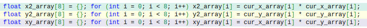
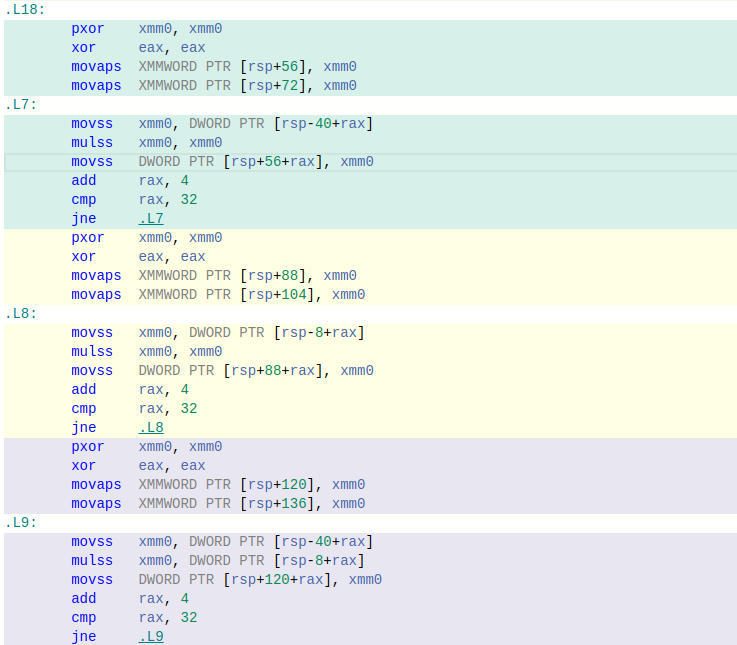
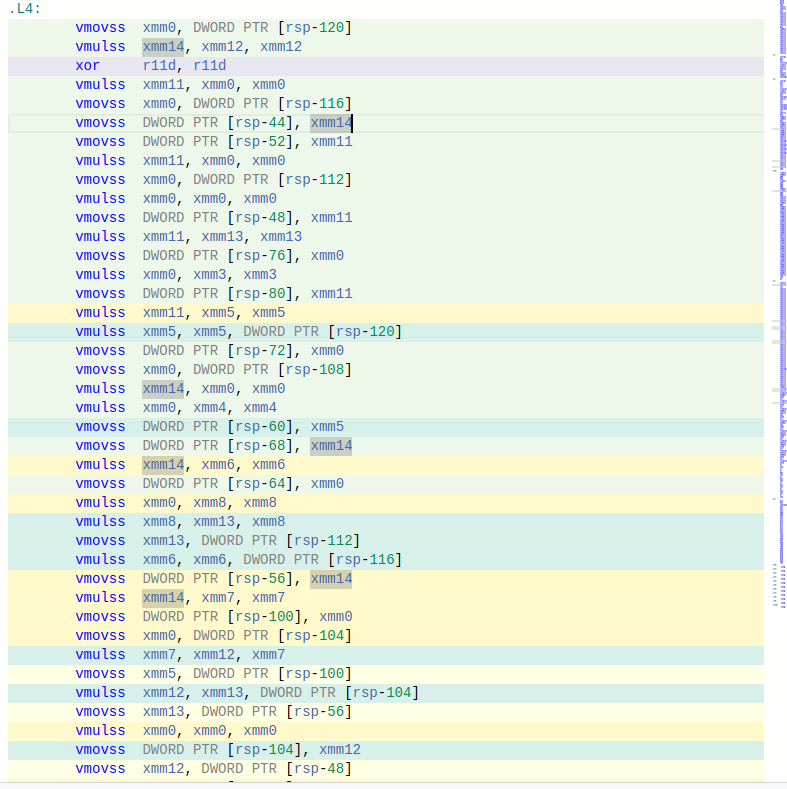

# Лабораторная работа
# Тема: "Оптимизация алгоритма расчета множества Мандельброта с помощью SIMD" 
<br>

### Александров Олег
### Б05-331 
### 29.03.2024 

<br>

# Цель работы 
Исследовать влияние оптимизаций компилятора и SIMD инструкций на время расчёта алгоритма Мандельброта.

# Содержание
1. [Реализация](#реализация)
    1. [Теоретическая справка](#теоретическая-справка)
    2. [Запуск программы](#запуск-программы)
        1. [Зависимости](#зависимости)
    3. [Реализованные режимы](#реализованные-режимы)
        1. [Тестовой режим](#тестовой-режим)
        2. [Графический режим](#графический-режим)
    4. [Реализованные алгоритмы](#реализованные-алгоритмы)
        1. [Простая реализация](#простая-реализация)
        2. [Векторная реализация](#векторная-реализация)
        3. [AVX реализация](#AVX-реализация)
2. [Измерение времени](#измерение-врмени)
    1. [Методика измерений](#методика-измерений)
    2. [Оборудование](#оборудование)
    3. [Результаты](#результаты)
    4. [Анализ результатов](#анализ-результатов)
3. [Вывод](#вывод)
4. [Благодарности](#благодарности)
5. [Библиографический список](#библиографический-список)
6. [Приложение](#приложение)

# Реализация

## Теоретическая справка


Рассмотрим действительную плоскость и точку из области построения на ней. Координаты точки будем обозначать как $x_0$ и $y_0$. Для каждой точки рассмотрим последовательность, каждый следующий элемент которой будет вычисляться по формуле:

$$y_{n+1} = 2 x_n y_n + x_0$$

$$x_{n+1} = x_n^2 - y_n^2 + y_0$$

Вычисления будут проводиться, пока $n < 256$ и $x_n^2 + y_n^2 \leq 100$. Точки, которые не вышли за пределы окружности радиусом $100$, образуют [множество Мандельброта](https://mathworld.wolfram.com/MandelbrotSet.html). На картинке они покрашены в черный цвет. Остальные точки не входят в [множество Мандельброта](https://mathworld.wolfram.com/MandelbrotSet.html), они покрашены в другие цвета. 

Для точек не из [множества Мандельброта](https://mathworld.wolfram.com/MandelbrotSet.html) цвет зависит от $n$. Библиотека [SFML](https://www.sfml-dev.org/) задаёт цвет пикселя в формате `rgba`. Далее цвет рассчитывается по 

|        R        |        G       |         B        |   A   |
|:---------------:|:--------------:|:----------------:|:-----:|
| $255 * sin(n)$  | $255 * cos(n)$ | $255 * sin(2 n)$ | $255$ |

## Запуск программы

Запуск программы avx реализации в графическом режиме подсчета [множества Мандельброта](https://mathworld.wolfram.com/MandelbrotSet.html):

```
git clone git@github.com:Ch1n-ch1nless/MandelbrotSet.git
cd MandelbrotSet
make OPT_LEVEL=-O3
./mandelbrot_set -g -i avx
```

Про другие режимы и инструкции в разделах:
[Реализованные режимы](#реализованные-режимы) и [Реализованные алгоритмы](#реализованные-алгоритмы)

Теперь подробнее про команды:
В makefile надо указать значение переменной OPT_LEVEL, в которой хранится уровень оптимизации программы(-O0, -O3, ...)

```
make OPT_LEVEL=<уровень оптимизации>
```

Гайд по запуску программы:
Флаги:

| Флаг | Что он делает                                    |
|:----:|:------------------------------------------------:|
|  -h  | показать гайд, как правильно запустить программу |
|  -t  | запустить программу в тестовом режиме            |
|  -g  | запустить программу в графическом режиме         |

Так же необходимо указать реализацию функции подсчета множества Мандельброта.

|    Флаг   | Что делает алгоритм                                           |
|:---------:|:-------------------------------------------------------------:|
| -i simple | будет считать каждый пиксель на экране отдельно               |
| -i vector | считает по 8 пикселей за раз без использования SIMD инструкций|
| -i avx    | считает по 8 пикселей за заз с использованием SIMD инструкций |

Примеры запуска:
```
./mandelbrot_set -g -i vector   # запустить программу в графическом режиме и векторной реализации
./mandelbrot_set -i simple -t   # запустить программу в тестовом режиме и попиксельной реализации
```

### Зависимости

Для графики была использована библиотека: [SFML](https://www.sfml-dev.org/) <br>
Требуемая архитектура компьютера: `x86-64` <br>
Требуется поддержка процессором [AVX](https://www.laruence.com/sse/#techs=AVX)/[AVX2](https://www.laruence.com/sse/#techs=AVX2) инструкции.

## Реализованные режимы

Всего было написано 2 режима: тестовый(`-t`) и графический(`-g`).

### Тестовой режим

Программа `256` раз прогоняет алгоритм расчета множества Мандельброта. 

Число `256` было выбрано, так как тогда погрешность расчёта < 5%, что является хорошим результатом. 
Точная погрешность расчета в [таблице](#таблица-относительных-погрешностей).

**Описание расчёта** 

Для каждой реализации был запущен тестовой режим и было получено среднее значение. 

Во время исполнения программы в тестовом режиме не было открыто других вкладок и ноутбук был на зарядке. 

Таких запусков было несколько, я запускал по 5 раз. Посчитал среднее значение полученных тактов и среднее квадратичное отклонение.

Далее разделил среднее квадратичное отклонение на среднее значение и получил относительную погрешность. Полученные относительные погрешности записаны в [таблице относительных погрешностей](#таблица-относительных-погрешностей). А среднее значение в таблицу из приложения.

Пример кода на Си:

``` C
void TestFunction(void (*CalculateMandelbrotSet)(unsigned int* pixel_array, Coords* coords_begin))
{
    //Create array, which contains colors of pixels
    unsigned int* pixel_array = (unsigned int*) calloc(SCREEN_HEIGHT * SCREEN_WIDTH, sizeof(unsigned int));
    assert((pixel_array != nullptr) && "Program can not allocate memory!\n");

    Coords coords_begin = {};   //< Structure, which contains camera position coordinates
    
    unsigned long long time_begin   = __rdtsc();            //< Detect the number of clock cycles before the algorithm is executed

    for (int i = 0; i < 256; i++)
    {
        CalculateMandelbrotSet(pixel_array, &coords_begin); //< Algorithm
    }

    unsigned long long time_end     = __rdtsc();            //< Detect the number of clock cycles after the algorithm is executed
    printf("%lld\n", time_end - time_begin);                //< Print on the screen number of clock cycles.

    free(pixel_array);
}
```

### Графический режим

Программа запускает окно $800 \times 600$, где рисуется множество Мандельброта. В левом верхнем углу показывается FPS.


<kbd>←</kbd> -- Переместить камеру влево    \
<kbd>↑</kbd> -- Переместить камеру вверх    \
<kbd>→</kbd> -- Переместить камеру вправо   \
<kbd>↓</kbd> -- Переместить камеру вниз     \
\
<kbd>+</kbd> -- Приблизить камеру   \
<kbd>-</kbd> -- Отдалить камеру     \
\
<kbd>Esc</kbd> -- Выйти из программы 

## Реализованные режимы

### Простая реализация (SIMPLE)

Простая реализация заключается в переводе на язык Си всего, что было написано в [теоретической справке](#теоретическая-справка).
Сам алгоритм в теле цикла пересчета элементов последовательности обрабатывает 1 пиксель. 

Код на `C` можно увидеть в source/mandelbrot_calc.cpp/[PerPixelCalculateMandelbrotSet()](https://github.com/Ch1n-ch1nless/MandelbrotSet/blob/4e1cae34593f027b608469ad3a83d6037623ba7e/source/mandelbrot_calc.cpp#L3).  

### Векторная реализация (VECTOR)

Данная реализация отличается от простой реализации тем, что алгоритм в теле цикла одновременно обрабатывает 8 пикселей. 
Тем самым показываем компилятору, что можно векторизовать вычисления. 

Примера кода на `C` можно увидеть в source/mandelbrot_calc.cpp/[VectorCalculateMandelbrotSet()](https://github.com/Ch1n-ch1nless/MandelbrotSet/blob/4e1cae34593f027b608469ad3a83d6037623ba7e/source/mandelbrot_calc.cpp#L38). 

### Avx реализация (AVX)

В этой реализации используются машинно зависимые векторные инструкции процессора. \
В моей реализации были использованы команды из [набора инструкций AVX/AVX2](https://www.laruence.com/sse/#techs=AVX,AVX2). 

Код на `C`находится в source/mandelbrot_calc.cpp/[AVXCalculateMandelbrotSet()](https://github.com/Ch1n-ch1nless/MandelbrotSet/blob/4e1cae34593f027b608469ad3a83d6037623ba7e/source/mandelbrot_calc.cpp#L91).  

# Измерение времени

## Методика измерений

Измерение времени производилось с помощью функции [__rdtsc()](https://learn.microsoft.com/ru-ru/cpp/intrinsics/rdtsc?view=msvc-170). Эта функция возвращает количество тактов с момента последнего сброса процессора (CPU reset). \
Само  измерение времени для каждой реализации алгоритма происходило в [тестовом режиме](#тестовой-режим). Каждый тест запускался по `5` раз. Во время запуска тестов не было открыто других сторонних вкладок и ноутбук был на зарядке.

## Оборудование

**Компилятор**: `g++ (Ubuntu 11.4.0-1ubuntu1~22.04) 11.4.0` \
**Уровни оптимизаций**: `-O0, -O1, -O2, -O3` \
[Список всех флагов](#полный-список-всех-флагов) \
**Процессор** : \
 \
**ОС** : `Linux Ubuntu 22.04.4 LTS (64-bit)`. Все тесты были проведены в режиме "Performance"

## Результаты

Все таблицы с результатами можно увидеть по [ссылке](#таблица-1). 
Тут будет показана диаграмма, которая построена по данным таблицы ниже.


Таблица увеличения производительности относительно простой реализации с уровнем оптимизации = -O0.
[Полная таблица относительной производительности](#таблица-относительной-производительности)

|       |   -O0 |   -O1 |   -O2 |   -O3 |
|:-----:|:-----:|:-----:|:-----:|:-----:|
| SIMPLE|  1.00 |  2.77 |  3.03 |  3.02 |
| VECTOR|  0.39 |  1.87 |  1.98 |  5.90 |
| AVX   |  2.77 | 19.56 | 19.56 | 20.20 | 

## Анализ результатов

Из таблицы видно, что VECTOR-O3 в 2 раза быстрее, чем VECTOR-O2. Произведя анализ их ассемблерного кода с помощью сайта [godbolt.org](https://godbolt.org/). можно увидеть, откуда такой рост.

**Для векторной реализации, запущенной с флагом -O2 в тестовом режиме.**
Исходный код:


Ассемблер:


**Для векторной реализации, запущенной с флагом -O3 в тестовом режиме.**
Исходный код:


Ассемблер:


Видно, что флаг `-O3` развертывает циклы, а `-O2` нет. Увеличение в производительности произошло не с помощью использования AVX-инструкций. 

Если через godbolt проанализировать остальные файлы, то можно увидеть, что AVX-инструкции использует только реализация алгоритма `AVX`.

# Вывод

Из таблиц и графиков видно флаг оптимизации `-O3` ускоряет работу программы в ~3 раза. Вне зависимости от реализации алгоритма. \
При флаге `-O3` время работы алгоритма, который не использует SIMD инструкции, но векторизует вычисления, в ~6 раз больше, чем время работы алгоритма, который не векторизует вычисления, без флагов оптимизации. \
Использование SIMD инструкций ускоряет программу в ~20 раз в сравнении с программой без векторизации вычислений и флага оптимизации. 

# Благодарности

[Дединский Илья Рудольфович](https://github.com/ded32) -- преподаватель курса \
[Мухорин Матвей](https://github.com/matmuher)          -- мой ментор

# Источники

1. **Computer Systems: A Programmer's Perspective** 3rd Edition by **Randal Bryant**, **David O'Hallaron**
2. **Compiler explorer** - [godbolt.com](https://godbolt.com)
3. **Mirror of Intel Intrinsics Guide** - [laurence.com/sse](https://www.laruence.com/sse/)
4. **Лекции Северова Д.С.**  - [ссылка](https://www.youtube.com/watch?v=BjcJ1fK139s&list=PLthfp5exSWEoOGJTuRZAPrZNUmTrTaUZ4)
5. **Гайд по работе с SFML** - [ссылка](https://www.sfml-dev.org/tutorials/2.6/)

# Приложение

#### Полный список всех флагов

``` 
-Wshadow -Winit-self -Wredundant-decls -Wcast-align -Wundef -Wfloat-equal\
-Winline -Wunreachable-code -Wmissing-declarations -Wmissing-include-dirs \
-Wswitch-enum -Wswitch-default -Weffc++ -Wmain -Wextra -Wall -g -pipe -fexceptions\
-Wcast-qual -Wconversion -Wctor-dtor-privacy -Wempty-body -Wformat-security\
-Wformat=2 -Wignored-qualifiers -Wlogical-op -Wno-missing-field-initializers -Wnon-virtual-dtor\
-Woverloaded-virtual -Wpointer-arith -Wsign-promo -Wstack-usage=8192 -Wstrict-aliasing\
-Wstrict-null-sentinel -Wtype-limits -Wwrite-strings -Werror=vla\
-D_DEBUG -mavx2 -mfma -mavx -msse4.2
```

#### Таблица 1

Первый запуск тестов. В таблице указано среднее количество тактов и погрешность. \
Данные в таблице имеют размерность такт $\cdot 10^5$.

|    1   |        -O0      |        -O1      |        -O2      |        -O3      |
|:------:|:---------------:|:---------------:|:---------------:|:---------------:|
| SIMPLE | $12168 \pm 60$  |  $4461 \pm 16$  |  $4104 \pm 24$  |  $4105 \pm 25$  |
| VECTOR | $27756 \pm 218$ |  $6314 \pm 18$  |  $5870 \pm 325$ |  $1936 \pm 18$  |
| AVX    | $4279  \pm 11$  |  $605  \pm 4$   |   $607 \pm 6$   |   $600 \pm 4$   |

#### Таблица 2

Второй запуск тестов. В таблице указано среднее количество тактов и погрешность. \
Данные в таблице имеют размерность такт $\cdot 10^5$.

|    2   |        -O0      |        -O1      |        -O2      |        -O3      |
|:------:|:---------------:|:---------------:|:---------------:|:---------------:|
| SIMPLE | $12155 \pm 18$  |  $4460 \pm 11$  |  $4100 \pm 11$  |  $4102 \pm 16$  |
| VECTOR | $27565 \pm 30$  |  $6277 \pm 15$  |  $5333 \pm 21$  |  $1955 \pm 13$  |
| AVX    | $4277  \pm 91$  |  $604  \pm 4$   |   $605 \pm 4$   |   $601 \pm 4$   |


#### Таблица 3

Третий запуск. В таблице указано среднее количество тактов и погрешность. \
Данные в таблице имеют размерность такт $\cdot 10^5$.

|    3   |        -O0      |        -O1      |        -O2      |        -O3      |
|:------:|:---------------:|:---------------:|:---------------:|:---------------:|
| SIMPLE | $12155 \pm 18$  |  $4461 \pm 16$  |  $4104 \pm 24$  |  $4105 \pm 25$  |
| VECTOR | $27651 \pm 43$  |  $6356 \pm 30$  |  $5372 \pm 18$  |  $1934 \pm 18$  |
| AVX    | $4279  \pm 11$  |  $605  \pm 4$   |   $607 \pm 6$   |   $600 \pm 4$   |

#### Таблица 4

4-ый запуск. В таблице указано среднее количество тактов и погрешность. \
Данные в таблице имеют размерность такт $\cdot 10^5$.

|    4   |        -O0      |        -O1      |        -O2      |        -O3      |
|:------:|:---------------:|:---------------:|:---------------:|:---------------:|
| SIMPLE | $12157 \pm 19$  |  $4461 \pm 16$  |  $4110 \pm 24$  |  $4105 \pm 25$  |
| VECTOR | $27656 \pm 45$  |  $6320 \pm 28$  |  $5368 \pm 25$  |  $1936 \pm 11$  |
| AVX    | $4279  \pm 12$  |  $603  \pm 4$   |   $607 \pm 6$   |   $600 \pm 4$   |

#### Таблица 5

5-ый запуск. В таблице указано среднее количество тактов и погрешность. \
Данные в таблице имеют размерность такт $\cdot 10^5$.

|    5   |        -O0      |        -O1      |        -O2      |        -O3      |
|:------:|:---------------:|:---------------:|:---------------:|:---------------:|
| SIMPLE | $12168 \pm 17$  |  $4461 \pm 16$  |  $4104 \pm 24$  |  $4105 \pm 25$  |
| VECTOR | $27587 \pm 35$  |  $6314 \pm 34$  |  $5358 \pm 32$  |  $1937 \pm 18$  |
| AVX    | $4278  \pm 11$  |  $604  \pm 4$   |   $607 \pm 6$   |   $600 \pm 4$   |

#### Финальная таблица

Данные в таблице имеют размерность такт $\cdot 10^5$. В каждой ячейке находится среднее значение количества тактов и погрешность.

|  FINAL |        -O0      |        -O1      |        -O2      |        -O3      |
|:------:|:---------------:|:---------------:|:---------------:|:---------------:|
| SIMPLE | $12168 \pm 17$  |  $4461 \pm 16$  |  $4104 \pm 24$  |  $4105 \pm 25$  |
| VECTOR | $27587 \pm 35$  |  $6314 \pm 34$  |  $5467 \pm 46$  |  $1936 \pm 20$  |
| AVX    | $4278  \pm 11$  |  $604  \pm 4$   |   $607 \pm 7$   |   $600 \pm 5$   |

#### Таблица относительной производительности:

SIMPLE = S, VECTOR = V и AVX = A. 

| col / row | S-O0  | S-O1  | S-O2  | S-O3  | V-O0  | V-O1  | V-O2  | V-O3  | A-O0  | A-O1  | A-O2  | A-O3  |
|:---------:|:-----:|:-----:|:-----:|:-----:|:-----:|:-----:|:-----:|:-----:|:-----:|:-----:|:-----:|:-----:|
|   S-O0    | 1.00  | 0.36  | 0.33  | 0.33  | 2.56  | 0.53  | 0.50  | 0.18  | 0.36  | 0.05  | 0.05  | 0.05  |
|   S-O1    | 2.79  | 1.00  | 0.92  | 0.92  | 7.10  | 0.68  | 0.71  | 0.49  | 1.00  | 0.14  | 0.14  | 0.14  |
|   S-O2    | 3.03  | 1.09  | 1.00  | 1.00  | 7.74  | 0.62  | 0.65  | 0.55  | 1.09  | 0.15  | 0.15  | 0.14  |
|   S-O3    | 3.00  | 1.09  | 1.00  | 1.00  | 7.67  | 0.63  | 0.64  | 0.53  | 1.08  | 0.15  | 0.15  | 0.15  |
|   V-O0    | 0.39  | 0.14  | 0.12  | 0.13  | 1.00  | 0.21  | 0.20  | 0.07  | 0.14  | 0.02  | 0.02  | 0.02  |
|   V-O1    | 1.98  | 1.47  | 1.60  | 1.59  | 4.83  | 1.00  | 0.95  | 0.34  | 0.68  | 0.10  | 0.10  | 0.09  |
|   V-O2    | 1.98  | 1.41  | 1.54  | 1.56  | 5.07  | 1.05  | 1.00  | 0.35  | 0.72  | 0.10  | 0.10  | 0.10  |
|   V-O3    | 5.60  | 2.02  | 1.85  | 1.87  | 14.07 | 2.96  | 2.83  | 1.00  | 2.02  | 0.29  | 0.29  | 0.28  | 
|   A-O0    | 2.77  | 0.99  | 0.91  | 0.92  | 7.08  | 1.46  | 1.40  | 0.49  | 1.00  | 0.14  | 0.14  | 0.14  |
|   A-O1    | 19.56 | 7.05  | 6.46  | 6.52  | 50.03 | 10.35 | 9.87  | 3.49  | 7.05  | 1.00  | 1.00  | 0.97  |
|   A-O2    | 19.56 | 7.05  | 6.46  | 6.52  | 50.03 | 10.35 | 9.87  | 3.49  | 7.05  | 1.00  | 1.00  | 0.97  |
|   A-O3    | 20.11 | 7.24  | 6.64  | 6.71  | 51.44 | 10.64 | 10.15 | 3.59  | 7.25  | 1.03  | 1.03  | 1.00  |

#### Таблица относительных погрешностей

|       |  -O0  |  -O1  |  -O2  |  -O3  |
|:-----:|:-----:|:-----:|:-----:|:-----:|
| SIMPLE|   1%  |   1%  |   3%  |   2%  |  
| VECTOR|   1%  |   2%  |   1%  |   2%  | 
| AVX   |   3%  |   2%  |   3%  |   2%  |