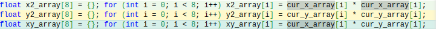

# Лабораторная работа
# Тема: "Оптимизация алгоритма расчета множества Мандельброта с помощью SIMD" 
<br>

### Александров Олег
### Б05-331 
### 11.04.2024 

<br>

# Цель работы 
Исследовать, как влияют оптимизации компилятора и использование SIMD-инструкций на время расчета множества Мандельброта.

# Содержание
1. [Реализация](#реализация)
    1. [Теоретическая справка](#теоретическая-справка)
    2. [Запуск программы](#запуск-программы)
        1. [Зависимости](#зависимости)
    3. [Режимы](#режимы)
        1. [Тестовой режим](#тестовой-режим)
        2. [Графический режим](#графический-режим)
    4. [Оптимизации](#оптимизации)
        1. [Без оптимизаций](#без-оптимизаций-simple)
        2. [Векторная оптимизация](#векторная-оптимизация-vector)
        3. [AVX-оптимизация](#avx-оптимизация-avx)
2. [Измерение времени](#измерение-времени)
    1. [Методика измерений](#методика-измерений)
    2. [Оборудование](#оборудование)
    3. [Результаты](#результаты)
    4. [Анализ результатов](#анализ-результатов)
3. [Вывод](#вывод)
4. [Благодарности](#благодарности)
5. [Библиографический список](#библиографический-список)
6. [Приложение](#приложение)

# Реализация

## Теоретическая справка


[Множество Мандельброта](https://mathworld.wolfram.com/MandelbrotSet.html) - фрактал, множество точек на комплексной плоскости, для которых задано рекуррентное соотношение $z_{n+1} = z_n^2 + z_0$. Классический способ раскраски предполагает: множество точек, для которых существует действительное $R$, такое что для любых натуральных $n$ выполняется $|z_n|< R$. В работе координаты плоскости $(x, y)$ рассчитываются по следующей формуле. 

$$y_{n+1} = 2 x_n y_n + x_0$$

$$x_{n+1} = x_n^2 - y_n^2 + y_0$$

В моей программе вычисления проводятся, пока $n < 256$ и $x_n^2 + y_n^2 \leq 100$. Точки, которые не вышли за пределы окружности радиусом $100$, образуют [множество Мандельброта](https://mathworld.wolfram.com/MandelbrotSet.html). На картинке они покрашены в черный цвет. Остальные точки не входят в [множество Мандельброта](https://mathworld.wolfram.com/MandelbrotSet.html), они покрашены в другие цвета. 

Для точек не из [множества Мандельброта](https://mathworld.wolfram.com/MandelbrotSet.html) цвет зависит от $n$. Библиотека [SFML](https://www.sfml-dev.org/) задаёт цвет пикселя в формате `rgba`. Далее цвет рассчитывается по 

|        R        |        G       |         B        |   A   |
|:---------------:|:--------------:|:----------------:|:-----:|
| $255 \cdot sin(n)$  | $255 \cdot cos(n)$ | $255 \cdot sin(2 n)$ | $255$ |

## Запуск программы

Запуск программы в графическом режиме c AVX-оптимизациями подсчета [множества Мандельброта](https://mathworld.wolfram.com/MandelbrotSet.html):

```
git clone git@github.com:Ch1n-ch1nless/MandelbrotSet.git
cd MandelbrotSet
make OPT_LEVEL=-O3
./mandelbrot_set -g -i avx
```

Про другие режимы и оптимизации в разделах:
[Режимы](#режимы) и [Оптимизации](#оптимизации)

Теперь подробнее про команды:
При вызове makefile надо указать значение переменной OPT_LEVEL, в которой хранится уровень оптимизации программы(-O0, -O3, ...)

```
make OPT_LEVEL=<уровень оптимизации>
```

Гайд по запуску программы:
Флаги:

| Флаг | Что он делает                                                  |
|:----:|:--------------------------------------------------------------:|
|  -h  | показать гайд, как правильно запустить программу               |
|  -t  | запустить программу в [тестовом](#тестовой-режим) режиме       |
|  -g  | запустить программу в [графическом](#графический-режим) режиме |

Так же необходимо указать реализацию функции подсчета множества Мандельброта.

|    Флаг   | Что делает алгоритм                                           |
|:---------:|:-------------------------------------------------------------:|
| -i simple | будет считать каждый пиксель на экране отдельно               |
| -i vector | считает по 8 пикселей за раз без использования SIMD-инструкций|
| -i avx    | считает по 8 пикселей за раз с использованием SIMD-инструкций |

Примеры запуска:
```
./mandelbrot_set -g -i vector   # запустить программу в графическом режиме и с использованием векторных оптимизаций
./mandelbrot_set -i simple -t   # запустить программу в тестовом режиме и без использования оптимизаций
```

### Зависимости

Для графики была использована библиотека: [SFML](https://www.sfml-dev.org/) <br>
Требуется поддержка процессором [AVX](https://www.laruence.com/sse/#techs=AVX)/[AVX2](https://www.laruence.com/sse/#techs=AVX2) инструкции.

## Режимы

У программы есть 2 режима: [тестовый](#тестовой-режим)(`-t`) и [графический](#графический-режим)(`-g`).

### Тестовой режим

Программа `256` раз прогоняет алгоритм расчета множества Мандельброта. 

Число `256` было выбрано так, чтобы погрешность расчёта времени работы программы была < 5%. 
Точная погрешность расчета находится в [таблице](#таблица-относительных-погрешностей).

Пример кода на Си:

``` C
void TestFunction(void (*CalculateMandelbrotSet)(unsigned int* pixel_array, Coords* coords_begin))
{
    //Create array, which contains colors of pixels
    unsigned int* pixel_array = (unsigned int*) calloc(SCREEN_HEIGHT * SCREEN_WIDTH, sizeof(unsigned int));
    assert((pixel_array != nullptr) && "Program can not allocate memory!\n");

    Coords coords_begin = {};   //< Structure, which contains camera position coordinates
    
    unsigned long long time_begin   = __rdtsc();            //< Detect the number of clock cycles before the algorithm is executed

    for (int i = 0; i < 256; i++)
    {
        CalculateMandelbrotSet(pixel_array, &coords_begin); //< Algorithm
    }

    unsigned long long time_end     = __rdtsc();            //< Detect the number of clock cycles after the algorithm is executed
    printf("%lld\n", (time_end - time_begin) / 256);        //< Print on the screen number of clock cycles.

    free(pixel_array);
}
```

### Графический режим

Программа запускает окно $800 \times 600$, где рисуется множество Мандельброта. В левом верхнем углу показывается FPS.


<kbd>←</kbd> -- Переместить камеру влево    \
<kbd>↑</kbd> -- Переместить камеру вверх    \
<kbd>→</kbd> -- Переместить камеру вправо   \
<kbd>↓</kbd> -- Переместить камеру вниз     \
\
<kbd>+</kbd> -- Приблизить камеру   \
<kbd>-</kbd> -- Отдалить камеру     \
\
<kbd>Esc</kbd> -- Выйти из программы 

## Оптимизации

### Без оптимизаций (SIMPLE)

Простая оптимизация заключается в переводе на язык Си всего, что было написано в [теоретической справке](#теоретическая-справка).
Сам алгоритм в теле цикла пересчета элементов последовательности обрабатывает 1 пиксель. 

Код находится в [source/mandelbrot_calc.cpp/PerPixelCalculateMandelbrotSet()](https://github.com/Ch1n-ch1nless/MandelbrotSet/blob/4e1cae34593f027b608469ad3a83d6037623ba7e/source/mandelbrot_calc.cpp#L3).  

Код:
``` C
for (int number_of_iterations = 0; number_of_iterations < MAX_NUMBER_OF_ITERATIONS; number_of_iterations++)
{
    float x2 = x * x;
    float y2 = y * y;
    float xy = x * y;

    float r2 = x2 + y2;
    if (r2 > MAX_SQUARE_RADIUS) break;

    x = x2 - y2 + x0;
    y = xy + xy + y0;
}
```

### Векторная оптимизация (VECTOR)

Данная оптимизация отличается от предыдущей версии тем, что алгоритм в теле цикла одновременно обрабатывает 8 пикселей. 
Тем самым показываем компилятору, что можно векторизовать вычисления. 

Код находится в [source/mandelbrot_calc.cpp/VectorCalculateMandelbrotSet()](https://github.com/Ch1n-ch1nless/MandelbrotSet/blob/4e1cae34593f027b608469ad3a83d6037623ba7e/source/mandelbrot_calc.cpp#L38). 

Код:
``` C
for (int iter = 0; iter < MAX_NUMBER_OF_ITERATIONS; iter++)
{
    //Заполняем массивы квадратов x, y и их произведения.
    float x2_array[8] = {}; for (int i = 0; i < 8; i++) x2_array[i] = cur_x_array[i] * cur_x_array[i];
    float y2_array[8] = {}; for (int i = 0; i < 8; i++) y2_array[i] = cur_y_array[i] * cur_y_array[i];
    float xy_array[8] = {}; for (int i = 0; i < 8; i++) xy_array[i] = cur_x_array[i] * cur_y_array[i];
    
    float r2_array[8] = {}; for (int i = 0; i < 8; i++) r2_array[i] = x2_array[i] + y2_array[i];

    int is_point[8]   = {};

    for (int i = 0; i < 8; i++) is_point[i] = (r2_array[i] < MAX_SQUARE_RADIUS);

    int bit_mask = 0;
    for (int i = 0; i < 8; i++) bit_mask |= (is_point[i] << i);

    if (!bit_mask) break;

    for (int i = 0; i < 8; i++) iter_array[i] += is_point[i];

    for (int i = 0; i < 8; i++) cur_x_array[i] = x2_array[i] - y2_array[i] + x0_array[i];
    for (int i = 0; i < 8; i++) cur_y_array[i] = xy_array[i] + xy_array[i] + y0_array[i];
}
```

### AVX-оптимизация (AVX)

В этой оптимизации используются машинно зависимые векторные инструкции процессора. \
В моей оптимизации были использованы команды из [набора инструкций AVX/AVX2](https://www.laruence.com/sse/#techs=AVX,AVX2). 

Код находится в [source/mandelbrot_calc.cpp/AVXCalculateMandelbrotSet()](https://github.com/Ch1n-ch1nless/MandelbrotSet/blob/4e1cae34593f027b608469ad3a83d6037623ba7e/source/mandelbrot_calc.cpp#L91).  

Код:
``` C
for (int i = 0; i < MAX_NUMBER_OF_ITERATIONS; i++)
{
    __m256 x2 = _mm256_mul_ps(x_coords, x_coords);
    __m256 y2 = _mm256_mul_ps(y_coords, y_coords);
    __m256 xy = _mm256_mul_ps(x_coords, y_coords);

    __m256 r2 = _mm256_add_ps(x2, y2);

    __m256 cmp = _mm256_cmp_ps(r2, R2Max, _CMP_LT_OS);
    int bitmask = _mm256_movemask_ps(cmp);

    if (!bitmask)
    {
        break;
    }

    iterations = _mm256_add_epi32(_mm256_cvttps_epi32(_mm256_and_ps(cmp, mask_array)), iterations);

    x_coords = _mm256_add_ps(_mm256_sub_ps(x2, y2), x0_coords);
    y_coords = _mm256_add_ps(_mm256_add_ps(xy, xy), y0_coords);
}
```

# Измерение времени

## Методика измерений

Измерение времени производилось с помощью функции [__rdtsc()](https://learn.microsoft.com/ru-ru/cpp/intrinsics/rdtsc?view=msvc-170). Эта функция возвращает количество тактов с момента последнего сброса процессора (CPU reset). \

Само  измерение времени для каждой оптимизации происходило в [тестовом режиме](#тестовой-режим). Каждый тест запускался по `5` раз. Во время запуска тестов не было открыто других сторонних вкладок и ноутбук был на зарядке.

Для каждого запуска теста было получено среднее время работы алгоритма расчета в тактах. Обозначим его в дальнейшем, как $\overline{time}_i$, где $i$ - номер запуска.
После 5 запусков тестов для конкретной оптимизации считается среднее квадратичное отклонение времени $(\sigma)$. 
Далее была рассчитана относительная погрешность по следующим формулам: 

$$\varepsilon = \frac{\sigma}{\langle time \rangle} \cdot 100\%$$ 

$$\langle time \rangle = \frac{\overline{time}_1 + \overline{time}_2 + \overline{time}_3 + \overline{time}_4 + \overline{time}_5}{5} $$

Значение $\varepsilon$ записано в [таблицу относительных погрешностей](#таблица-относительных-погрешностей). \
Значение $\overline{time}_n$ записано в [таблицу под номером n](#таблица-1). \
Значение $\langle time \rangle$ записано в [финальную таблицу](#финальная-таблица).

## Оборудование

**Компилятор**: `g++ (Ubuntu 11.4.0-1ubuntu1~22.04) 11.4.0` \
**Уровни оптимизаций**: `-O0, -O1, -O2, -O3` \
[Список всех флагов](#полный-список-всех-флагов) \
**Процессор** : \
 \
**ОС** : `Linux Ubuntu 22.04.4 LTS (64-bit)`. Все тесты были проведены в режиме "Performance"

## Результаты

Все таблицы с результатами можно увидеть по [ссылке](#таблица-1). 
Тут будет показана диаграмма, которая построена по данным таблицы ниже.


Таблица увеличения производительности относительно простой реализации с уровнем оптимизации = -O0.
[Полная таблица относительной производительности](#таблица-относительной-производительности)

|       |   -O0 |   -O1 |   -O2 |   -O3 |
|:-----:|:-----:|:-----:|:-----:|:-----:|
| SIMPLE|  1.00 |  2.77 |  3.03 |  3.02 |
| VECTOR|  0.39 |  1.87 |  1.98 |  5.90 |
| AVX   |  2.77 | 19.56 | 19.56 | 20.20 | 

## Анализ результатов

Из таблицы видно, что VECTOR-O3 в 2 раза быстрее, чем VECTOR-O2. Произведя анализ их ассемблерного кода с помощью сайта [godbolt.org](https://godbolt.org/), можно понять причины такого роста.


**Для векторной реализации, запущенной с флагом -O2 в тестовом режиме.**
[Ссылка на godbolt](https://godbolt.org/#z:OYLghAFBqd5QCxAYwPYBMCmBRdBLAF1QCcAaPECAMzwBtMA7AQwFtMQByARg9KtQYEAysib0QXACx8BBAKoBnTAAUAHpwAMvAFYTStJg1DIApACYAQuYukl9ZATwDKjdAGFUtAK4sGIAKwAzKSuADJ4DJgAcj4ARpjEIGYapAAOqAqETgwe3r4BwemZjgLhkTEs8YnJtpj2JQxCBEzEBLk%2BfkG19dlNLQRl0XEJSSkKza3t%2BV3j/YMVVaMAlLaoXsTI7BzmgRHI3lgA1CaBbngsLBEExBEAdAgn2CYaAILPL%2BPEXg6HHiToCneJgA7FZXocIYcqLRUEwCIdVAB9BQIPBUAgnMEvSFQmFww4AT2RqPRmPeOOhsPhAC9UKgWGTXiCACKMt6vNAMcaHK44yEAWReAA1EVE5PyLNgAEqIgDyADFEQBJAAq0peKqVsqiQhxJ2ZhzM/gAbGz3pzuby%2BYchG4pdhsFFEQB1JXMlUACWt3sh%2BsOAA4NBo2Rb4Va%2Bbb7Y7ER7sEqAOIelU%2B71%2B41Bs0cgTcyn4nGCkVCACKche9sRUpezKVcl1KeOgQNhy4QduGioIez8Nz8Jx6CF9cHfL9zbbVAA9JJWx3AljQ7iqXz0ABNIdrhtNrhj8eBaedrndvG9yGFj1K%2BXJ9fWv0AWg0t2B/hnc67C7zkOXiKEZ4vV%2BvjYhe9233HMjz5AAtWVZX5RFmWweUXjkUJL3XEct2A2dzVfHs%2BVjBMkxdN1PQrbBQg1LUolTADDigHslkjB0nTwxMVSWQ5xxo6gj3ou1GMI90PSWTMXnnHCcW/c8VURNxtSEFUXiiFDBz9e8uGfLCDzfY8IUg6DpNk%2BTFKvP0tzU4SADdUDwdBDgANUwBwSDcMRkC8AwCEwflDCwWhYmIVBhEwAgIC8Lk8GASIbKuAAqQ5UjwVQ6kRFpiCYAlSF%2BOliABWK0H%2BBREXiYAIiEplQXJSF%2BGIGjeTwAkN0OYNZx5eqTjcG1eOjZik0xFrrGsUrsV9crwW9KqasEHlVAapqLCmht2oY6NXQE3qEuOSw/X9QafRBLEhxw1QNAavLsoKoqIhvR4kRRNF4WsTiuKpJZ1pvDqoydFbPQhDizDY2L%2B3%2Bw5ToBQrMGKhgrsCbBaXpNkDrAgljr9EHzvBy7HiJW70Q2uaoCeuEXvqt6lqYuMWPYw0gZXIHUbBiGoZhukWEOWLuqkr6PRIsjNW1YSEcXWGWERdBpr9ftWeBrLQYuyHHiF/nB0OjRkuIVKCRMfwLH9TWmwhP09qOjKjtxw4hZF1RjeRyxDWi83Rat03Ajt5mLcdh7JBd%2Bk3YRa25v8L3hYd33TeNQOfZNh7gXD0WWXhpXEZVlK0s17Xdb1AC9qRjLs8HXOh3zvOUjXQv61LlMkaHOPMKZUb6xw1ziERJFk41rWdf8A0DfK4FWWa8aIFqma1oWgM1v6yw2Mb5vVfV1O8HTv0jtnlOtYXzv4/rsDp6JVvU47rvM57vu5oHoeVJHtqx%2BahfNsn4H1kRXe1dXix18Pg0kZXtu391xX61qh5Jue927p19EfKwvd/4pjPpNQgCRh43yAaPAsopxSShlAqZUapKy8x1GtIBE8LA7WUiNIa65DpmG/vvReEDq6nxIBNMMiC5p4FHjrG%2BRC2KqCoSA3%2BncTqPxbi/H%2B79JbT2EXPNef8a7kLXDhAkvCRE0IEd3SBJ8oSMMHnAlhPJ2HjzvsQwkSipH8I/g/Juz9TFiNyo/Kxr936b3kWBVQ9if4HwantehmjqraOYRfG%2B%2BjOGGO4W4%2BetCDQSOodIgRtjLHRLMU4quddnGLmICY1%2BHi1HeNgf4gCs09FXw4awrhhx0kJLEUvDJojF420URUmRWIKrrlqgVdIVwVF62yVA2RzT5FaPPvky%2Bpxr4lJCTyNpVlBDhNUQBCA5S%2BGVJGag4spZyyVmrLWISvSUlDl5LEQgiIWBMAUAAaxYX0g6AydEBNYUEsZVh74HIIEck55yQRuD9IPSZHSYmH0%2BSMvA2ymm7MHGiGiYAwDPNeWctiflMBMFOdAq5vjBkGgKWwopBjHlGPgcA5RfzcZ%2BjwD86ZfzkVK2uXk9Fwz2rFJ5KUqJiyIkImqTMg0b16nMtUTbZe3KT6XMpaim5QzAlYuCTiqediGmzINK4mVXdeVhMJQ9L%2B/KkmpigbXORPpcmFNFXc8VDyBqCuvGQv88VEq0AqfVWKpN%2BLfQeutJ1LK8UKo1Wa1koL9ZarkXHMqXqXgcBWLQTg/heB%2BA4FoUgqBOCfMMYcBQawNiYA2oEHgpACCaGDSsU5AQUiho4JICN2aY2cF4AoEAKQs1RuDaQOAsAkBoBYPFegZAKAQGba2kYwAuBSD4HQIBlaICxFLQc5gxACScAzeOloBJZSxG0A5GtGbm1sEELKBgtAp21tIFgWIXhgDOVoLQSt3BeBYGOUYcQu78DEGXXgcymAz3RswIlVyHlp28CuHUUttA8B%2BTnR4LApbrjnC/aQJ9xBYgZEwMyTAV7gD/qMNmlY0ImDAAULZPAmAADuspUiMAg/wQQIgxDsH7SR%2BQSg1Clt0FwfQhhjBEP0ABytkAVioFSA0M9N5ZRmEODeY55keGCZYFQY5YmmAibEwoJQkhbhmF4KgKDNwsDsYgCsOwD7nAQFcFMPwDGwgRCGJUEYDGihZAEAZvQlmGjzGGIkBj2mHC9AmG0TwHQ9AuYaH0VoDmzNOdsO5mzzn3MBcWFwLTybNgSBDWGktu7Y0cARP6Y0N5jSSEOMAZAyBmxbiyxAXAhBGE7Ci7wGtWgli5vzfoTgxbSCRujclitVbM2ofixwJTjXS0tfa7W6rkGEiZGcJIIAA%3D)

Исходный код:


Ассемблер:


**Для векторной реализации, запущенной с флагом -O3 в тестовом режиме.**
[Ссылка на godbolt](https://godbolt.org/#z:OYLghAFBqd5QCxAYwPYBMCmBRdBLAF1QCcAaPECAMzwBtMA7AQwFtMQByARg9KtQYEAysib0QXACx8BBAKoBnTAAUAHpwAMvAFYTStJg1DIApACYAQuYukl9ZATwDKjdAGFUtAK4sGIAKwAzKSuADJ4DJgAcj4ARpjEIGYapAAOqAqETgwe3r4BwemZjgLhkTEs8YnJtpj2JQxCBEzEBLk%2BfkG19dlNLQRl0XEJSSkKza3t%2BV3j/YMVVaMAlLaoXsTI7BzmgRHI3lgA1CaBbngsLBEExBEAdAgn2CYaAILPL%2BPEXg6HHiToCneJgA7FZXocIYcqLRUEwCIdVAB9BQIPBUAgnMEvSFQmFww4AT2RqPRmPeOOhsPhAC9UKgWGTXiCACKMt6vNAMcaHK44yEAWReAA1EVE5PyLNgAEqIgDyADFEQBJAAq0peKqVsqiQhxJ2ZhzM/gAbGz3pzuby%2BYchG4pdhsFFEQB1JXMlUACWt3sh%2BsOAA4NBo2Rb4Va%2Bbb7Y7ER7sEqAOIelU%2B71%2B41Bs0cgTcyn4nGCkVCACKche9sRUpezKVcl1KeOgQNhy4QduGioIez8Nz8Jx6CF9cHfL9zbbVAA9JJWx3AljQ7iqXz0ABNIdrhtNrhj8eBaedrndvG9yGFj1K%2BXJ9fWv0AWg0t2B/hnc67C7zkOXiKEZ4vV%2BvjYhe9233HMjz5AAtWVZX5RFmWweUXjkUJL3XEct2A2dzVfHs%2BVjBMkxdN1PQrbBQg1LUolTADDigHslkjB0nTwxMVSWQ5xxo6gj3ou1GMI90PSWTMXnnHCcW/c8VURNxtSEFUXiiFDBz9e8uGfLCDzfY8IUg6DpNk%2BTFKvP0tzU4SADdUDwdBDgANUwBwSDcMRkC8AwCEwflDCwWhYmIVBhEwAgIC8Lk8GASIbKuAAqQ5UjwVQ6kRFpiCYAlSF%2BOliABWK0H%2BBREXiYAIiEplQXJSF%2BGIGjeTwAkN0OYNZx5eqTjcG1eOjZik0xFrrGsUrsV9crwW9KqasEHlVAapqLCmht2oY6NXQE3qEuOSw/X9QafRBLEhxw1QNAavLsoKoqIhvR4kRRNF4WsTiuKpJZ1pvDqoydFbPQhDizDY2L%2B3%2Bw5ToBQrMGKhgrsCbBaXpNkDrAgljr9EHzvBy7HiJW70Q2uaoCeuEXvqt6lqYuMWPYw0gZXIHUbBiGoZhukWEOWLuqkr6PRIsjNW1YSEcXWGWERdBpr9ftWeBrLQYuyHHiF/nB0OjRkuIVKCRMfwLH9TWmwhP09qOjKjtxw4hZF1RjeRyxDWi83Rat03Ajt5mLcdh7JBd%2Bk3YRa25v8L3hYd33TeNQOfZNh7gXD0WWXhpXEZVlK0s17Xdb1AC9qRjLs8HXOh3zvOUjXQv61LlMkaHOPMKZUb6xw1ziERJFk41rWdf8A0DfK4FWWa8aIFqma1oWgM1v6yw2Mb5vVfV1O8HTv0jtnlOtYXzv4/rsDp6JVvU47rvM57vu5oHoeVJHtqx%2BahfNsn4H1kRXe1dXix18Pg0kZXtu391xX61qh5Jue927p19EfKwvd/4pjPpNQgCRh43yAaPAsopxSShlAqZUapKy8x1GtIBE8LA7WUiNIa65DpmG/vvReEDq6nxIBNMMiC5p4FHjrG%2BRC2KqCoSA3%2BncTqPxbi/H%2B79JbT2EXPNef8a7kLXDhAkvCRE0IEd3SBJ8oSMMHnAlhPJ2HjzvsQwkSipH8I/g/Juz9TFiNyo/Kxr936b3kWBVQ9if4HwantehmjqraOYRfG%2B%2BjOGGO4W4%2BetCDQSOodIgRtjLHRLMU4quddnGLmICY1%2BHi1HeNgf4gCs09FXw4awrhhx0kJLEUvDJojF420URUmRWIKrrlqgVdIVwVF62yVA2RzT5FaPPvky%2Bpxr4lJCTyNpVlBDhNUQBCA5S%2BGVJGag4spZyyVmrLWISvSUlDl5LEQgiIWBMAUAAaxYX0g6AydEBNYUEsZVh74HIIEck55yQRuD9IPSZHSYmH0%2BSMvA2ymm7MHGiGiYAwDPNeWctiflMBMFOdAq5vjBkGgKWwopBjHlGPgcA5RfzcZ%2BjwD86ZfzkVK2uXk9Fwz2rFJ5KUqJiyIkImqTMg0b16nMtUTbZe3KT6XMpaim5QzAlYuCTiqediGmzINK4mVXdeVhMJQ9L%2B/KkmpigbXORPpcmFNFXc8VDyBqCuvGQv88VEq0AqfVWKpN%2BLfQeutJ1LK8UKo1Wa1koL9ZarkXHMqXqXgcBWLQTg/heB%2BA4FoUgqBOCfMMYcBQawNiYA2oEHgpACCaGDSsU5AQUiho4JICN2aY2cF4AoEAKQs1RuDaQOAsAkBoBYPFegZAKAQGba2kYwAuBSD4HQIBlaICxFLQc5gxACScAzeOloBJZSxG0A5GtGbm1sEELKBgtAp21tIFgWIXhgDOVoLQSt3BeBYGOUYcQu78DEGXXgcymAz3RswIlVyHlp28CuHUUttA8B%2BTnR4LApbrjnC/aQJ9xBYgZEwMyTAV7gD/qMNmlY0ImDAAULZPAmAADuspUiMAg/wQQIgxDsH7SR%2BQSg1Clt0FwfQhhjBEP0ABytkAVioFSA0M9N5ZSBEODeY55keGCZYFQY5YmmAibEwoJQkhbhmF4KgKDNwsDsYgCsOwD7nAQFcFMPwDGwgRCGJUEYDGihZAEAZvQlmGjzGGIkBj2mHC9AmG0TwHQ9AuYaH0VoDmzNOdsO5mzzn3MBcWFwLTybNgSBDWGktu7Y0cARP6Y0N5jSSEOMAZAyBmxbiyxAXAhBGE7Ci7wGtWgli5vzfoTgxbSCRujclitVbM2ofixwJTjXS0tfa7W6rkGEiZGcJIIAA%3D)

Исходный код:


Ассемблер:


Видно, что флаг `-O3` развертывает циклы, а `-O2` нет. Так же увеличение в производительности произошло из-за использования AVX-инструкций:
(movss -> vmovss; mulss ->vmulss).


Рассмотрим **код программы с avx-оптимизациями, запущенной с флагом -O3 в тестовом режиме**:
[Ссылка на godbolt](https://godbolt.org/#z:OYLghAFBqd5QCxAYwPYBMCmBRdBLAF1QCcAaPECAMzwBtMA7AQwFtMQByARg9KtQYEAysib0QXACx8BBAKoBnTAAUAHpwAMvAFYTStJg1DIApACYAQuYukl9ZATwDKjdAGFUtAK4sGIAKwAnKSuADJ4DJgAcj4ARpjEAf6kAA6oCoRODB7evgHBaRmOAuGRMSzxif7JdpgOWUIETMQEOT5%2BQbaY9sUMjc0EpdFxCUm2TS1teZ0KE4MRwxWj1QCUtqhexMjsHOYAzBHI3lgA1CZ7bngsLBEExBEAdAjn2CYaAIJv77PEXg4nHhI6AUXxMAHYrB8TtCTlRaKgmAQTqoAPoKBB4KgEc6Q94w2HwxEnACeaIxWJxX3xcIRSIAXqhUCxKR9wQARFmfD5oBizE63fEwgCy7wAGiionIhRZsAAlFEAeQAYiiAJIAFTl73VqoVUSE%2BPObJOZn8ADZOV8eXyBYKTkI3LLsNgoiiAOqqtnqgASdr9MKNJwAHBoNJzrUjbYKHU6XSjvdhVQBxb3q/1%2BwNm0OW7kCPk0on4kXioQARTk7ydKNl7zZqrkBvTZz2xpOXFDDw0VHDeaRBaR%2BPQoqbI8FgbbnaoAHpJB3u3tcRGCbTBegAJqjzfN1tcSdTvZznu8vuEgcwkve1VKtNbu2BgC0GgeYP888XveXhZha5RQkv19vO8W2hJ8uyPfNT0FAAtBUFSFFE2WwJV3jkUIby3cddzAhcrQ/ftBQTZNU3dT0fWrbBQm1XUogzYCTigfsVhjZ1XUIlN1RWE4p3o6hTyYx0WJIr1vRWHN3iXfD8T/K91RRNw9SEdV3iidCR0DJ8uDfXDj0/M9oRguC5IUpSVNvQNd00sSvgAN1QPB0BOd4ADVRTcMRkC8AwCEwIVDCwWhYmIVBhEwAgIC8Xk8GASIHNuAAqE4UjwVRuhRZpiCYYlSABRliGBBK0CBBQUXiYAIlE1kISpGEURRFhTTNE5ZTMXzVH9QM6vq800VCrgURSBQIGLX9y0rbBq1reshFEnCoRquqGpOFgmAUABrNLiAy4kA2AzqGp6gg%2BoGiBdyoGbcXxWqusalEwTNfxJD2Mx20NXbrn2pQCH6wawUnbKzT%2Bk5/EByRAb2QGzEBrCqGy0Czs5S6FvNE5/KaFE2rHN7roOo7BqHE4Cty4ESswMqGHvF4GSZc7QTm6F%2BGIeiBTwbb1JxflWYue0BLjNjU3ZlnrGsCq8QDKq6cFBmmcEfk2rZhdZebNxudjV0PWEgW5csQMgxF9rxdFpt8NUDRtxOQq8uK0qIgpvZsFRdFMSRaweN42kVmSk57xVwT1Z9aFuLMTiEqHYPzaJq3SZtynGWZWbDfTfDiVNwMLeJ63yZeUlHaxM5LFdxiWa9n3ecTdiuJNMP1zDtPI7J23sCplgCZOPnZL971yMonU9TE0crsWk2UVrs29u6ph0HQb6IDHs06s86fUaYdHstu%2B7HuejQ1hOWecenk2VhpiX/QH5Hk%2BHiPR/e7rPtxiBk6PrkE5PpHGtREfAyH2uEZHU/GtJD%2BwFz7f3jtVJsEUshnGPhmA2gE/54H5N5DKvQFBX2xrfFEmAkpPQgFvH%2BW5mZII2ltEw/gLBBlIRyeOo52R9xHFLCAzMzZhgVgg84ythqSmlHKRUKoNRah7vqAWQtLB6zUrA28f9kRmDQftFgC9jrvwjtlJRRVH5wNfiSGRHVr5z3kbQaeADlEkgvmo/Bm4pGqE5saXe%2Bj96mMttlIxZjQHQKbFI4g2isb7QnlPRRZgnFBzoVuKRyAWApFkd1MJKRp6eOys1Vqq83BCmUCiNCipprmNHAKWIhBlprUiXo1A1lMD5PWsdaJj8wGbkxPRMAYBckEDKWIjCEjALQkCpgJgq0sniI5KyNx6ZCAJERFkVBOjsa%2BMwdgswM9dHD2sgQAgA1pl4BwbvPy09onZTKcQzKh9srDOQWMqpgz/SqMtoUtKk9p67wUF4WI%2B8AlaO3l/CO6jbzOMuRMnxNzjobL%2BYNKxKjiTb2Ae83pd4wT9KfqOBhTD5YWH5ErYMwjtaiOqfrC6W4kopQMelTKpCLBFwSsxOMHc85Is9i7PAlCzZHL2cSIltL/BUOxU2WhgzOUJ25dyjgaxaCcH8LwPwHAtCkFQJwNwIikUKA2FsTAec9g8FIAQTQ/K1irQCBofQnBJAivVRKzgvAFAgB1WqsV/LSBwFgEgNA4S6AJHIJQe1SV6CJGAFwKQfA6BINNRAWIhrcnMGIMSTgKrg3NGJAqWI2g6gWpVfatgggFQMFoGGy1pAsCxC8MANytBaCmu4LwLAy0jDiEzfgYg8a8AlKLeKzAKUPLeXDbwW43RDW0DwIFKNHgsCGruFcVtpASnEFiOkTAbJSmGGAF2ow6q1hwiYMABQTk8CYAAO4KhSIwYd/BBAiDEOwb1%2B75BKDUIa3QXB9AzpQDK/Q3bTWQDWKgFIKDOD3gVHsL2y1rKqBkfeFgVBlo/qYH%2Bn9CglCgzMLwYpCR7hYCfRANYtR6jOAgK4KYfhr1hAWOUSoehCiZAEFhwj6RiMMCGPh0Y17UO9H6JMTw7Q9B0YaHMKjIxEi0bmKR7jAwONLC4yh%2BV2wJACqFQazNkqODIiDGae8ZpJAnGAMgZAbZdxKYgLgQgJAlVcBWLwC1WgDlav8DqwVHB9WkFFeK6TJqzWqoXeJjgMHrOGrs45y1BzR0ZGcJIIAA%3D%3D%3D)

Исходный код:


Ассемблер:


Из картинки видно, что в программе используются YMM-регистры, а не XMM-регистры, поэтому программа с AVX-оптимизациями работает в ~4 раза быстрее, чем с VECTOR оптимизациями.

# Вывод

Из таблиц и графиков видно флаг оптимизации `-O3` ускоряет работу программы в ~3 раза вне зависимости от реализации алгоритма. 

При флаге `-O3` время работы алгоритма c VECTOR оптимизациями в ~6 раз меньше, чем время работы алгоритма без оптимизаций. \
Использование AVX-инструкций ускоряет программу в ~20 раз в сравнении с программой без оптимизаций. 

# Благодарности

Хочу отдельно поблагодарить [Дединского Илью Рудольфовича](https://github.com/ded32)(мой преподаватель) и [Мухорина Матвея](https://github.com/matmuher)(мой ментор). Без их помощи README.md выглядело бы хуже и я написал программу хуже :)

# Источники

1. **Computer Systems: A Programmer's Perspective** 3rd Edition by **Randal Bryant**, **David O'Hallaron**
2. **Compiler explorer** - [godbolt.com](https://godbolt.com)
3. **Mirror of Intel Intrinsics Guide** - [laurence.com/sse](https://www.laruence.com/sse/)
4. **Лекции Северова Д.С.**  - [ссылка](https://www.youtube.com/watch?v=BjcJ1fK139s&list=PLthfp5exSWEoOGJTuRZAPrZNUmTrTaUZ4)
5. **Гайд по работе с SFML** - [ссылка](https://www.sfml-dev.org/tutorials/2.6/)

# Приложение

#### Полный список всех флагов

``` 
-Wshadow -Winit-self -Wredundant-decls -Wcast-align -Wundef -Wfloat-equal\
-Winline -Wunreachable-code -Wmissing-declarations -Wmissing-include-dirs \
-Wswitch-enum -Wswitch-default -Weffc++ -Wmain -Wextra -Wall -g -pipe -fexceptions\
-Wcast-qual -Wconversion -Wctor-dtor-privacy -Wempty-body -Wformat-security\
-Wformat=2 -Wignored-qualifiers -Wlogical-op -Wno-missing-field-initializers -Wnon-virtual-dtor\
-Woverloaded-virtual -Wpointer-arith -Wsign-promo -Wstack-usage=8192 -Wstrict-aliasing\
-Wstrict-null-sentinel -Wtype-limits -Wwrite-strings -Werror=vla\
-D_DEBUG -mavx2 -mfma -mavx -msse4.2
```

#### Таблица 1

Первый запуск тестов. В таблице указано среднее количество тактов. \
Погрешность указана в [таблице относительных погрешностей](#таблица-относительных-погрешностей). \
Данные в таблице имеют размерность такт $\cdot 10^5$.

|    1   |    -O0   |   -O1    |    -O2   |   -O3    |
|:------:|:--------:|:--------:|:--------:|:--------:|
| SIMPLE | $12168$  |  $4461$  |  $4104$  |  $4105$  |
| VECTOR | $277568$ |  $6314$  |  $58705$ |  $1936$  |
| AVX    | $4279 $  |  $605$   |   $607$  |   $600$  |

#### Таблица 2

Второй запуск тестов. В таблице указано среднее количество тактов. \
Погрешность указана в [таблице относительных погрешностей](#таблица-относительных-погрешностей). \
Данные в таблице имеют размерность такт $\cdot 10^5$.

|    2   |    -O0   |   -O1    |    -O2   |    -O3   |
|:------:|:--------:|:--------:|:--------:|:--------:|
| SIMPLE | $12155$  |  $4460$  |  $4100$  |  $4102$  |
| VECTOR | $27565$  |  $6277$  |  $5333$  |  $1955$  |
| AVX    | $4277 $  |  $604 $  |   $605$  |   $601$  |


#### Таблица 3

Третий запуск. В таблице указано среднее количество тактов. \
Погрешность указана в [таблице относительных погрешностей](#таблица-относительных-погрешностей). \
Данные в таблице имеют размерность такт $\cdot 10^5$.

|    3   |   -O0    |    -O1   |    -O2   |    -O3   |
|:------:|:--------:|:--------:|:--------:|:--------:|
| SIMPLE | $12155$  |  $4461$  |  $4104$  |  $4105$  |
| VECTOR | $27651$  |  $6356$  |  $5372$  |  $1934$  |
| AVX    | $4279 $  |  $605$   |   $607$  |   $600$  |

#### Таблица 4

4-ый запуск. В таблице указано среднее количество тактов. \
Погрешность указана в [таблице относительных погрешностей](#таблица-относительных-погрешностей). \
Данные в таблице имеют размерность такт $\cdot 10^5$.

|    4   |   -O0    |   -O1    |   -O2    |   -O3    |
|:------:|:--------:|:--------:|:--------:|:--------:|
| SIMPLE | $12157$  |  $4461$  |  $4110$  |  $4105$  |
| VECTOR | $27656$  |  $6320$  |  $5368$  |  $1936$  |
| AVX    | $4279 $  |  $603 $  |   $607$  |   $600$  |

#### Таблица 5

5-ый запуск. В таблице указано среднее количество тактов. \
Погрешность указана в [таблице относительных погрешностей](#таблица-относительных-погрешностей). \
Данные в таблице имеют размерность такт $\cdot 10^5$.

|    5   |   -O0    |    -O1   |    -O2   |    -O3   |
|:------:|:--------:|:--------:|:--------:|:--------:|
| SIMPLE | $12168$  |  $4461$  |  $4104$  |  $4105$  |
| VECTOR | $27587$  |  $6314$  |  $5358$  |  $1937$  |
| AVX    | $4278 $  |  $604 $  |   $607$  |   $600$  |

#### Финальная таблица

Данные в таблице имеют размерность такт $\cdot 10^5$. В каждой ячейке находится среднее значение количества тактов. \
Погрешность указана в [таблице относительных погрешностей](#таблица-относительных-погрешностей). \

|  FINAL |   -O0    |   -O1    |   -O2    |   -O3    |
|:------:|:--------:|:--------:|:--------:|:--------:|
| SIMPLE | $12168$  |  $4461$  |  $4104$  |  $4105$  |
| VECTOR | $27587$  |  $6314$  |  $5467$  |  $1936$  |
| AVX    | $4278 $  |  $604 $  |   $607$  |   $600$  |

#### Таблица относительных погрешностей

|       |  -O0  |  -O1  |  -O2  |  -O3  |
|:-----:|:-----:|:-----:|:-----:|:-----:|
| SIMPLE|   1%  |   1%  |   3%  |   2%  |  
| VECTOR|   1%  |   2%  |   1%  |   2%  | 
| AVX   |   3%  |   2%  |   3%  |   2%  |

#### Таблица относительной производительности:

SIMPLE = S, VECTOR = V и AVX = A. 

| col / row | S-O0  | S-O1  | S-O2  | S-O3  | V-O0  | V-O1  | V-O2  | V-O3  | A-O0  | A-O1  | A-O2  | A-O3  |
|:---------:|:-----:|:-----:|:-----:|:-----:|:-----:|:-----:|:-----:|:-----:|:-----:|:-----:|:-----:|:-----:|
|   S-O0    | 1.00  | 0.36  | 0.33  | 0.33  | 2.56  | 0.53  | 0.50  | 0.18  | 0.36  | 0.05  | 0.05  | 0.05  |
|   S-O1    | 2.79  | 1.00  | 0.92  | 0.92  | 7.10  | 0.68  | 0.71  | 0.49  | 1.00  | 0.14  | 0.14  | 0.14  |
|   S-O2    | 3.03  | 1.09  | 1.00  | 1.00  | 7.74  | 0.62  | 0.65  | 0.55  | 1.09  | 0.15  | 0.15  | 0.14  |
|   S-O3    | 3.00  | 1.09  | 1.00  | 1.00  | 7.67  | 0.63  | 0.64  | 0.53  | 1.08  | 0.15  | 0.15  | 0.15  |
|   V-O0    | 0.39  | 0.14  | 0.12  | 0.13  | 1.00  | 0.21  | 0.20  | 0.07  | 0.14  | 0.02  | 0.02  | 0.02  |
|   V-O1    | 1.98  | 1.47  | 1.60  | 1.59  | 4.83  | 1.00  | 0.95  | 0.34  | 0.68  | 0.10  | 0.10  | 0.09  |
|   V-O2    | 1.98  | 1.41  | 1.54  | 1.56  | 5.07  | 1.05  | 1.00  | 0.35  | 0.72  | 0.10  | 0.10  | 0.10  |
|   V-O3    | 5.60  | 2.02  | 1.85  | 1.87  | 14.07 | 2.96  | 2.83  | 1.00  | 2.02  | 0.29  | 0.29  | 0.28  | 
|   A-O0    | 2.77  | 0.99  | 0.91  | 0.92  | 7.08  | 1.46  | 1.40  | 0.49  | 1.00  | 0.14  | 0.14  | 0.14  |
|   A-O1    | 19.56 | 7.05  | 6.46  | 6.52  | 50.03 | 10.35 | 9.87  | 3.49  | 7.05  | 1.00  | 1.00  | 0.97  |
|   A-O2    | 19.56 | 7.05  | 6.46  | 6.52  | 50.03 | 10.35 | 9.87  | 3.49  | 7.05  | 1.00  | 1.00  | 0.97  |
|   A-O3    | 20.11 | 7.24  | 6.64  | 6.71  | 51.44 | 10.64 | 10.15 | 3.59  | 7.25  | 1.03  | 1.03  | 1.00  |